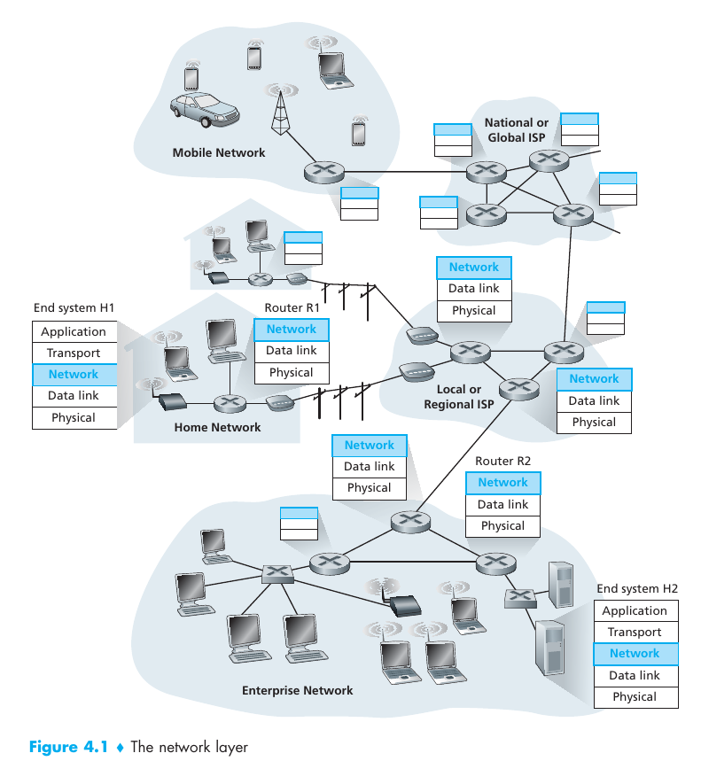

# Computer Networkin a Top-Down Approach 6th Edition
## Chapter 4: The Network Layer
The chapter covers:
* Overview of the network layer and its services
* Two approaches for packet delivery and the addressing's role
* Router's HW architecture and organization
* Packet forwarding in the Internet and its IP(Internet Protocol)
* NAT (Network Address Transalation), datagram fragmentation, the ICMP(Internet Message Protocol) and IPv6
* Network layer's routing function
* Routing algorithms: Link-state and Distance Vector.
* Internet's intra-autonomous system routing protocols(RIP, OSPF and IS-IS) and its inter-autonomous system routing protocol (BGP)
* Broadcast and multicas routing
--- 
**Note**:
* Forwarding -> transfer of a packet from an incoming link to an outgoing link within a single router
* Routing -> all of a network's routers, whose collective interactions via **routing protocols** determine the paths that packets take on their trips from source to destination node.
---
### Introduction
When sending info from H1 to H2. The process follows:
* The network layer in H1 takes segments from teh transport layer
* Encapsulates each segment into a datagram
* Sends to its nearby router R1
* At receiving H2 the network layer receives the datagrams from its nearby R2
* Extracts the transport-layers segmennt
* Delivers the segments up to the transport layer at H2

#### Forwarding and Routing 
* Forwarding: when a packet arrives at a router's input linke, the router move the packet to the appropriate output link. (Local action)
* Routing: the network layer must determine the route taken by packets as they flow from a sender to a receiver. (network-wide process)
* Every router has a **forwardin table** for the router to determine the outgoing link interface to forward based on the packet's header.
* The routing algorithm determines the values that are inserted into the router's forwarding tables.
	* It can be centralized or decentralized, but it always receives routing protocol messages.
* **packet switch** is a general packet-switching device that transfer a packet from input link interface to output link interface.
	* **link-layer** base their forwarding decision on values in the fields of the link-layer frame (layer 2 devices)
	* **routers** base their decision on the value in the network layer fiels (layer 3), but must also implement layer 2 protocols
#### Network Service Models
The **network service model** defines the characteristics of end-to-end transport of packets.
The network layer can provide different services:
* In the sending host
	* Guaranteed delivery
	* Guaranteed delivery with bounded delay(e.g. 100msec)
* On the flow
	* In-order packet delivery
	* Guaranteed minimal bandwidth (e.g 1Mbps)
	* Guaranteed maximun jitter: This guarantees that the amount of time between the transmission of 2 successive pakcet at the sender is equal to the amount of time between their receipt at the destination)
	* Security services.(encryption, data integrity, source auth)

The Internet's network layer provides **best-effor** service
* Bandwidth: None
* No-Loss: None
* Orderin: Any order possible
* Time: Not maintained
* Congestion Indication: None

There are other models that offer better services:
* ATM's CBR(Constant Bit Rate)
	* Guaranteed constant bandwidht rate
	* Order
	* No-loss
	* Timing maintained
	* Congestion not occur
* ATM's ABR(Available bit rate)
	* Guaranteed minimun bandwidth
	* In order
	* Congestion indication
### Virtual Circuit and Datagram Networks

