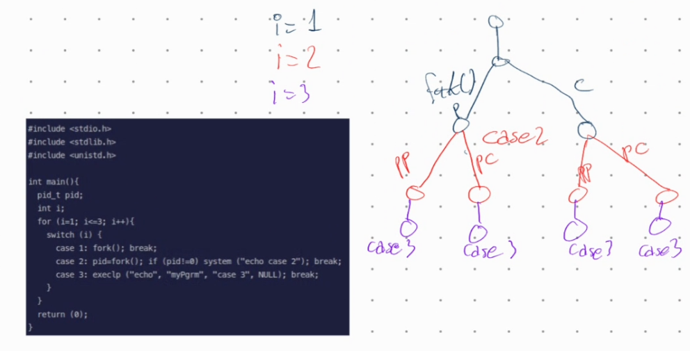
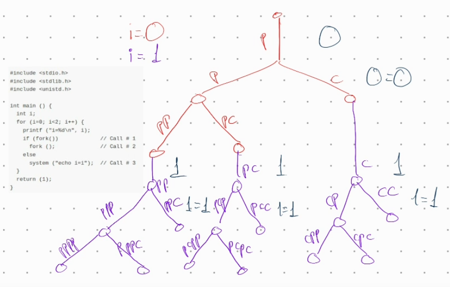
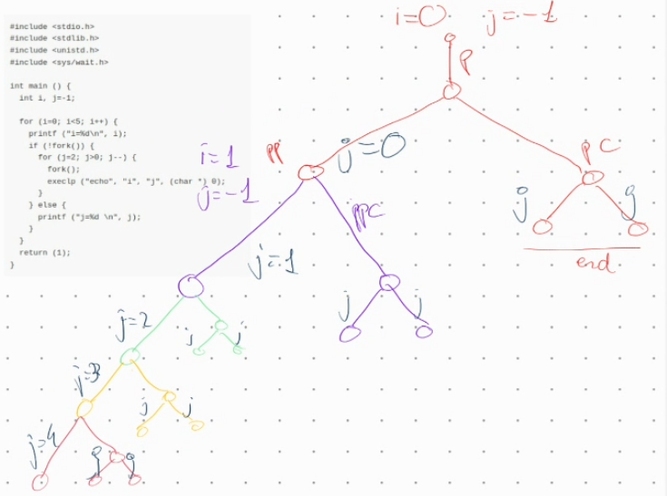

System and Device Programming
Laboratory number 01 (System and Programming part)


Learning goals
--------------

Review laboratory: Operating system basics, i.e., processes, signals, threads.
Solve all exercises ore just the ones more suited for you, at choice.

 

Exercise 01
Code analysis: fork, exec, system
---------------------------------

Given the following program, draw the process generation tree and indicate
what it displays and for what reason.
```
#include <stdio.h>
#include <stdlib.h>
#include <unistd.h>

int main(){
  pid_t pid;
  int i;
  for (i=1; i<=3; i++){
    switch (i) {
      case 1: fork(); break;
      case 2: pid=fork(); if (pid!=0) system ("echo case 2"); break;
      case 3: execlp ("echo", "myPgrm", "case 3", NULL); break;
    }
  }
  return (0);
} 
```


It would print:
* case 2 
  * case 3
  * case 3
* <None> 
  * case 3
  * case 3

e.g.  
case 2    
case 3  
case 3  
case 3  
case 3  

Exercise 02

Code analysis: fork, exec, system
---------------------------------

Given the following program, draw the process generation tree and indicate
what it displays and for what reason.
```
#include <stdio.h>
#include <stdlib.h>
#include <unistd.h>

int main () {
  int i;
  for (i=0; i<2; i++) {
    printf ("i=%d\n", i);
    if (fork())             // Call # 1
      fork ();              // Call # 2
    else
      system ("echo i=i");  // Call # 3
  }
  return (1);
}
```

It would print  
* 0
  * 0=0
    * 1
      * 1=1
  * 1
    * 1=1
  * 1
    * 1=1

Exercise 03
Code analysis: fork, exec, system
---------------------------------

Given the following program, draw the process generation tree and indicate
what it displays and for what reason.

```
#include <stdio.h>
#include <stdlib.h>
#include <unistd.h>
#include <sys/wait.h>

int main () {
  int i, j=-1;

  for (i=0; i<5; i++) {
    printf ("i=%d\n", i);
    if (!fork()) {
      for (j=2; j>0; j--) {
        fork();
        execlp ("echo", "i", "j", (char *) 0);
      }
    } else {
      printf ("j=%d \n", j);
    }
  }
  return (1);
}
```



Exercise 04
Code implementation with processes
----------------------------------

Write a C program that receives two integer values on the command line,
h and n, and it generates a process tree of height h and degree n.

For example, if h=2 and n=2:
- the main process creates two processes
- each one of these 2 processes creates other two processes
- each one of these 4 processes creates other two processes
at this point, 8 leaf processes run and the program must stop.

More in detail each node of the tree is a process.
The initial process generates n child jobs and ends.
The same thing must be done by all child processes, generating a
number of processes on the leaves of the tree equal to n^h.
Processes on the leaves must all display their own PID and end.

Solution
```
#include <stdio.h>
#include <stdlib.h>
#include <unistd.h>
#include <sys/wait.h>

int main(int argc, char **argv) {
	int h = atoi(argv[1]);
	int n = atoi(argv[2]);
	int total = 1;
	printf("Starting with h=%d and n=%d\n", h, n);
	for (int level=0; level<=h; level++) {
		int child_id=0;
		for (int child=0; child<n; child++) {
			child_id = (int) fork();
			if (!child_id) {
				break;
			} 
		}
		if (child_id) exit(0);
	}
	int pid = getpid();
	printf("Finishing leaf %d \n", pid);
}
```

Exercise 05
Code implementation with processes
----------------------------------

A binary number of size n can be easily generated by a recursive function
like the one reported in file e05recursive.c

Transform the recursive program into a concurrent one, replacing the
recursive procedure with the generation of an appropriate number of
*processes*.
Each process must display one binary number.
Binary numbers can be displayed in any order.

For example, if n=3, the function must generate and print numbers:
000, 001, 010, 011, 100, 101, 110, 111
IN ANY ORDER.
```

#include <stdio.h>
#include <stdlib.h>

void binary_function(int *, int);
void print_int_location(int *ptr, size_t length);

int main ( int argc, char *argv[]) {
  int n;
  int *vet;

  n = atoi (argv[1]);

  vet = (int *) malloc(n * sizeof(int));
  if (vet == NULL) { printf("Allocatin Error.\n"); exit(1); }

  printf("Binary Numbers:\n");

  binary_function(vet, n);

  free(vet);

  return 0;
}

void binary_function ( int *vet, int n) {
  int j;
  for (j=0; j<n; j++) {
    int child_id = 0;
    for (int k=0; k<2; k++){
      child_id = (int) fork();
      if (!child_id) {
        if (k==0) vet[j] = 0;
        if (k==1) vet[j] = 1;
        break;
      }
    }
    if (child_id) exit(0);
  }
  print_int_location(vet, n);
  return;
}

void print_int_location(int *ptr, size_t length){
  size_t i = 0;
  for ( ; i< length; i++) printf("%d", ptr[i]);
  printf("\n");
}
```

Exercise 06
Code implementation with processes and signals
----------------------------------------------

Write a C program that is able to handle signals as described by the 
following
specifications.
The program accepts signals SIGUSR1 and SIGUSR2, and:
- It displays a "success" message every time it receives a signal SIGUSR1 followed
  by a signal SIGUSR2, or vice-versa.
- It displays an error message every time it receives two signals SIGUSR1 or two
  signals SIGUSR2 consecutively.
- It terminates if it receives three successive SIGUSR1 or SIGUSR2 signals.

Suggestion
-----------
Once it is compiled, run the program in the background (...&) and use the shell
command "kill" to send signals SIGUSR1 and SIGUSR2 to the process.

Solution
```

#include <stdlib.h>
#include <stdio.h>
#include <unistd.h>
#include <signal.h>
#include <stdbool.h>

int sigusr1Count = 0;
int sigusr2Count = 0;
bool lastSignal1 = false;
bool lastSignal2 = false;

static void signalHandler(int signal);

int main (int argc, char *argv[]) {
  int n;
  n = atoi(argv[1]);
  signal(SIGUSR1, signalHandler);
  signal(SIGUSR2, signalHandler);
  while (1){
    sleep(2);
    n++;
    fprintf(stdout, "Increasing n to %d\n", n);
  }
}

static void signalHandler(int signal) {
  bool success = (lastSignal1 && signal == SIGUSR2) ||
    (lastSignal2 && signal == SIGUSR1);
  if (success) fprintf(stdout, "success\n");

  if (signal == SIGUSR1) { 
    lastSignal1 = true;
    lastSignal2 = false;
    sigusr1Count++;
    sigusr2Count = 0;
  }
  if (signal == SIGUSR2) {
    lastSignal1 = false;
    lastSignal2 = true;
    sigusr2Count++;
    sigusr1Count = 0;
  }

  if (sigusr1Count == 2 || sigusr2Count == 2) fprintf(stdout, "error\n");
  if (sigusr1Count == 3 || sigusr2Count == 3) exit(0);

}
```


Exercise 07
Code implementation with threads
(a variant of exercise 04, but with threads)
--------------------------------------------

Implement a C program, thread_generation, that receives a command line parameter
n.
The parent thread creates two threads and waits for their termination.
Each further thread creates the other two threads, and it awaits their termination. 
Tread creation stops after 2^n threads have been created, i.e., the ones that stand
on the leaves of a tree with 2^n leaves.

For example, if n=3
- the main thread creates two threads
- each one of these 2 threads creates other two threads,
- each one of these 4 threads creates other two threads
at this point, 8 leaf treads are running and the program must stop.

Each leaf thread must print its generation tree, i.e., the sequence of thread
identifiers from the main thread (the tree root) to the leaf thread (tree leaf).

The following is an example of the program execution: 

quer@quer-VirtualBox:~/current/sdp$ ./l01e05 3  
140051327870720 140051311085312 140051224717056   
140051327870720 140051311085312 140051224717056   
140051327870720 140051311085312 140051233109760   
140051327870720 140051319478016 140051207931648   
140051327870720 140051311085312 140051233109760   
140051327870720 140051319478016 140051207931648   
140051327870720 140051319478016 140051216324352   
140051327870720 140051319478016 140051216324352   

Suggestion
----------
Print (and store) thread identifiers (tids) as "long integer"
values.


Exercise 08
Code implementation with threads
--------------------------------

In linear algebra, the multiplication of matrices is the operation that
produces a new matrix C by making the product rows for columns of two
given matrices A and B.
More in detail, if A has size [r, x] and B has size [x, c], then C will
have size [r, c], and each of its own position elements (i, j) will be
computed as:
$$
C[i][j] = \sum_{k=0}^{x-1} A[i][k] x B[k][j]
$$

Write a multithreaded function

void mat_mul (int **A, int **B, int r, int x, int c, int **C);

able to generate the matrix C, running a thread to compute
each one of its elements.
Each thread will calculate the value of the element, making the product
rows by columns previously specified.
Properly define the data structure required to run the threads.

